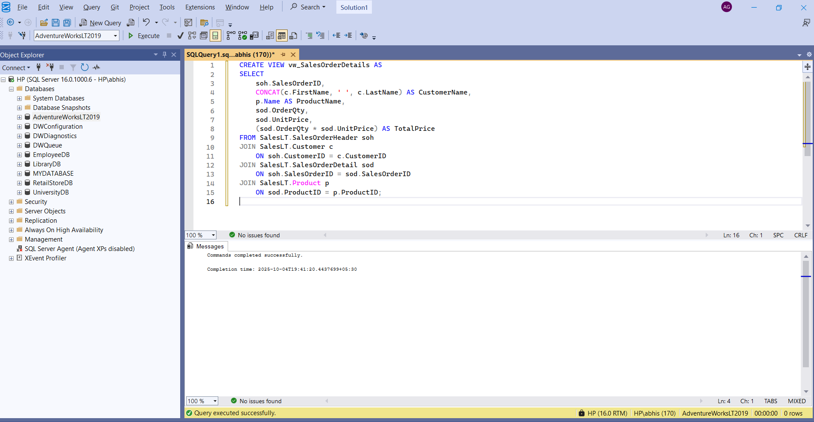
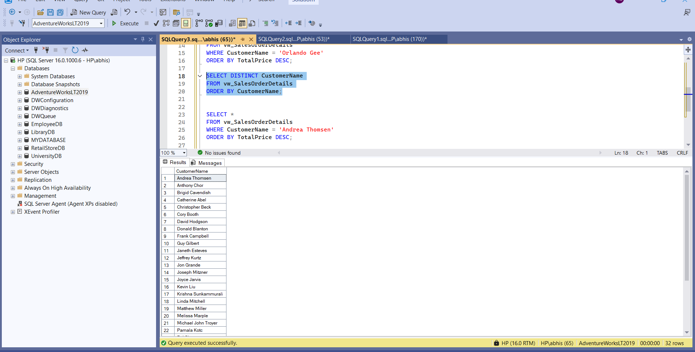
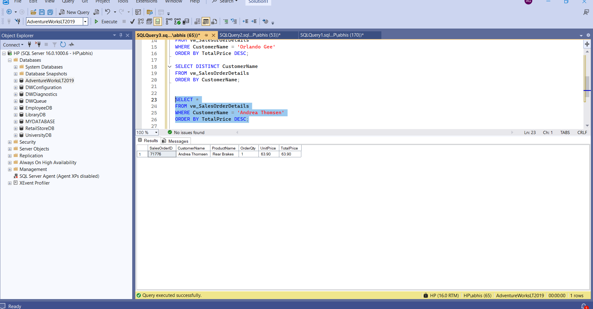
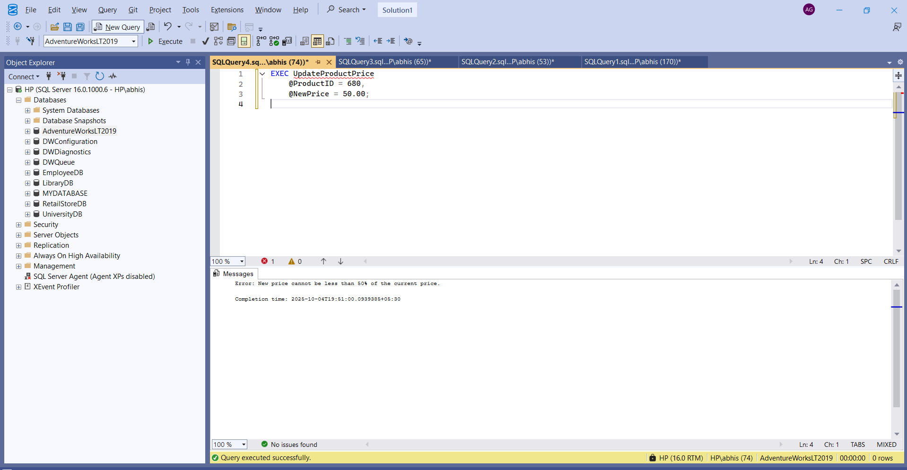

# Sales Analysis System (AdventureWorksLT2019)

A step-by-step SQL Server project using the **AdventureWorksLT2019** sample database in **SSMS**. The README embeds all SQL and screenshots inline for immediate review.

---

## Project Steps

### 1) Create the View
```sql
CREATE VIEW vw_SalesOrderDetails AS
SELECT
    soh.SalesOrderID,
    CONCAT(c.FirstName, ' ', c.LastName) AS CustomerName,
    p.Name AS ProductName,
    sod.OrderQty,
    sod.UnitPrice,
    (sod.OrderQty * sod.UnitPrice) AS TotalPrice
FROM SalesLT.SalesOrderHeader soh
JOIN SalesLT.Customer c
    ON soh.CustomerID = c.CustomerID
JOIN SalesLT.SalesOrderDetail sod
    ON soh.SalesOrderID = sod.SalesOrderID
JOIN SalesLT.Product p
    ON sod.ProductID = p.ProductID;
```


---

### 2) Create the Stored Procedure
```sql
CREATE PROCEDURE UpdateProductPrice
    @ProductID INT,
    @NewPrice DECIMAL(10, 2)
AS
BEGIN
    DECLARE @CurrentPrice DECIMAL(10, 2);

    SELECT @CurrentPrice = ListPrice
    FROM SalesLT.Product
    WHERE ProductID = @ProductID;

    IF @NewPrice < (@CurrentPrice * 0.5)
    BEGIN
        PRINT 'Error: New price cannot be less than 50% of the current price.';
        RETURN;
    END

    UPDATE SalesLT.Product
    SET ListPrice = @NewPrice
    WHERE ProductID = @ProductID;

    PRINT 'Product price updated successfully.';
END;
```


---

### 3) Query the View
```sql
SELECT *
FROM vw_SalesOrderDetails
WHERE CustomerName = 'Andrea Thomsen'
ORDER BY TotalPrice DESC;
```


---

### 4) Execute the Stored Procedure
```sql
EXEC UpdateProductPrice 
    @ProductID = 680,
    @NewPrice = 50.00;
```


---

## Tech Stack
- SQL Server 2019 / SSMS
- AdventureWorksLT2019

## Notes
- Ensure screenshots are placed under `Screenshots/` with exact names used above.
